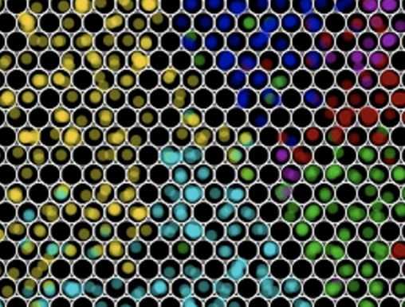

[](https://doi.org/10.3390/molecules25184189)


 
# UVPD 

**Ultra HRMS in combination with Ultraviolet Photodissociation fragmentation
for enhanced structural identification of organic micropollutants**

## Online shiny demo 
http://fgcz-ms-shiny.uzh.ch:8080/p2722-uvpd/


## Project description

Exploring the benefits of the new fragmentation technique Ultraviolet Photodissociation (UVPD) and ultra-high resolution mass spectrometry (HRMS) for enhanced structural identification of organic micropollutants on an Orbitrap Fusion Lumos Tribrid equipped with UVPD


## Relevance and aims

Advancements in high-resolution mass spectrometry (HRMS) based screening methods have enabled a shift from target to non-target analyses to detect chemicals in water samples. Non-target screening (NTS) has therefore become a promising tool to evaluate chemical water quality during water treatment1. However, the unambiguous structural identification of compounds based on HRMS/MS information remains challenging despite recent developments in instrumentation and cheminformatics2. This is in part due to the limits of elemental composition determination imposed by the achieved resolution of current instrumentation, and the poor MS2 fragmentation spectra of certain compounds generated by Higher-energy collisional dissociation (HCD) fragmentation, the fragmentation technique routinely applied in NTS. The Orbitrap Fusion Lumos Tribrid (Thermo Fisher Scientific) addresses both of these limitations3: the 1,000,000 FWHM ultra-high resolution potentially enables confident assignment of the elemental composition of small molecule analytes through fine isotope information and high isotopic fidelity on a liquid chromatography (LC) time-scale. Moreover, the availability of multiple fragmentation modes including Ultraviolet Photodissociation (UVPD), a new fragmentation technique achieved with a 213 nm UV laser, and improved MSn capability potentially allows structural elucidation of compounds that cannot be identified by HCD alone. For instance, UVPD was shown to facilitate characterization of various lipid classes4, to generate unique fragments or enhance detection of kinetically unfavorable fragments of flavonoids5, phenylpropanoids and chalconoids6. Here, we propose to investigate the potential of ultra-high resolution MS and UVPD fragmentation to improve structural identification of organic micropollutants relevant for the water sector. Furthermore, we will characterize and compare the HCD and UVPD fragmentation patterns of selected micropollutants, and attempt to derive rules for fragmentation based on substructures.


## Misc


### install the R package

```{r}
pkgs <- c('shiny', 'ggplot2')
pkgs <- pkgs[(!pkgs %in% unique(installed.packages()[,'Package']))]
if(length(pkgs) > 0){install.packages(pkgs)}

install.packages('http://fgcz-ms.uzh.ch/~cpanse/UVPD/uvpd_0.0.15.tar.gz',repos=NULL)

```

### run shiny application
<a href="http://fgcz-ms-shiny.uzh.ch:8080/p2722-stackedBarChart/"></a>

You can run the package's shiny application on our [demo system](http://fgcz-ms-shiny.uzh.ch:8080/p2722-stackedBarChart/) or, when installed, on your computer by executing the following R code snippet:

```{r}
shiny::runApp(file.path(system.file(package = 'uvpd'), 'shiny/stackedbarchart'))
```

## References

- [Evaluation of food-relevant chemicals in the ToxCast high-throughput screening program](https://doi.org/10.1016/j.fct.2016.04.012)

- Chemical Informatics Functionality in R DOI: [10.18637/jss.v018.i05](http://dx.doi.org/10.18637/jss.v018.i05)

- https://CRAN.R-project.org/package=rcdk

- ftp://ftp.ncbi.nlm.nih.gov/pubchem/specifications/pubchem_fingerprints.txt

- A new metaphor for projection-based visual analysis and data exploration Proc. SPIE
2007 | conference-paper [DOI: 10.1117/12.697879](https://www.spiedigitallibrary.org/conference-proceedings-of-spie/6495/1/A-new-metaphor-for-projection-based-visual-analysis-and-data/10.1117/12.697879.short?SSO=1)

- https://CRAN.R-project.org/package=protViz

- [rawDiag - Brings Orbitrap Mass Spectrometry Data to Life; Multi-platform, Fast and Colorful R package. ](https://github.com/fgcz/rawDiag) DOI: [10.1021/acs.jproteome.8b00173](https://pubs.acs.org/doi/10.1021/acs.jproteome.8b00173) 

- [MetFrag relaunched: incorporating strategies beyond in silico fragmentation: C Ruttkies, E L Schymanski, S Wolf, J Hollender, S Neumann Journal of Cheminformatics 2016 8:3 ](https://ipb-halle.github.io/MetFrag/)

-  Molecules 2020, 25(18), 4189; https://doi.org/10.3390/molecules25184189

